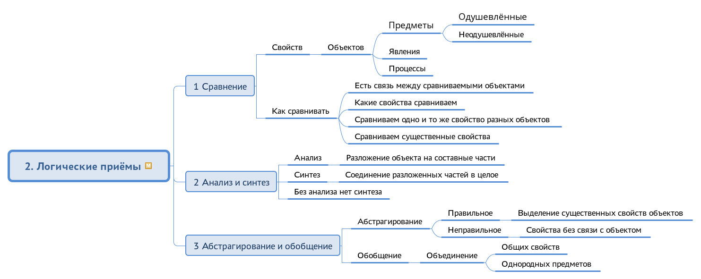

# Логика

## Пояснительная записка

Программа курса «Логика» направлена на формирование умения думать и рассуждать последовательно и непротиворечиво, которое требуется во многих жизненных ситуациях: в беседах с людьми, при освоении новых знаний, планировании своих действий, решении технических и управленческих задач. Курс развивает умение мыслить логически, последовательно приходить к умозаключениям, получать обоснованные выводы из имеющихся предпосылок. Закрепление теории сопровождается сопоставлением изученных понятий с жизнью, решением логических упражнений.

## Для кого предназначен курс

Курс рассчитан на 1 год обучения — всего 24 занятия длительностью по 1 часу. Курс рекомендован учащимся 5, 6 классов средней школы для подготовки по логике. Для успешного изучения данного курса требуется знание обучающимися следующего фундаментального теоретического материала в пределах начальной школы:

* русский язык
* математика

## Структура курса

Структура изучаемого курса состоит из следующих тем:

1. Предмет и задачи науки логики
2. Логические приёмы
3. Понятие
4. Определение и деление понятия
5. Суждение
6. Преобразование суждений
7. Основные законы логического мышления
8. Дедуктивные умозаключения
9. Индуктивные умозаключения
10. Аналогия
11. Гипотеза
12. Доказательство

## Содержание курса

### Предмет и задачи науки логики

Логика мышления и наука логика; логические законы и формы; о понимании мышления; мышление и язык; значение логики.

### Логические приёмы

Мышление – опосредствованное и обобщённое познание действительности; сравнение; анализ и синтез; абстрагирование и обобщение.

### Понятие

Сущность понятия; понятие и представление; понятие и слово; содержание и объём понятий; соотношение между содержанием и объёмом понятия; ограничение и обобщение понятия; родовые и видовые понятия; основные классы понятий; отношения между понятиями.

### Определение и деление понятия

Сущность определения понятия; правила определения; генетическое определение; номинальное определение; значение определений; приёмы, заменяющие определение; сущность деления понятия; правила деления; дихотомическое деление; приёмы, сходные с делением; классификация.

### Суждение

Сущность суждения; состав суждения; суждение и предложение; виды суждений; утвердительные и отрицательные суждения; единичные, частные и общие суждения; соединение делений суждений по количеству и по качеству; условные, разделительные и категорические суждения; суждения возможности, действительности и необходимости; объём подлежащего и сказуемого в суждении; отношения между суждениями.

### Преобразование суждений

Уточнение логического смысла суждений; превращение; обращение.

### Основные законы логического мышления

Понятие о логическом законе; закон тождества; закон противоречия; закон исключённого третьего; закон достаточного основания; значение логических законов.

### Дедуктивные умозаключения

Понятие об умозаключении; определение силлогизма; состав силлогизма; аксиома силлогизма; правила силлогизма; понятие о фигурах силлогизма; разновидности силлогизма; характеристика фигур; познавательное значение силлогизма; условно-категорический силлогизм; разделительно-категорический силлогизм; энтимема; о сложных силлогизмах.

### Индуктивные умозаключения

Сущность индукции; полная индукция; неполная индукция; научная индукция; о причинной связи явлений; методы исследования причинной связи явлений; условия применения методов индукции.

### Аналогия

Форма умозаключения.

### Гипотеза

Определение гипотезы; проверка гипотезы; гипотеза и теория.

### Доказательство

Определение логического доказательства; состав доказательства; доказательства прямые и косвенные; правила доказательства; опровержение.